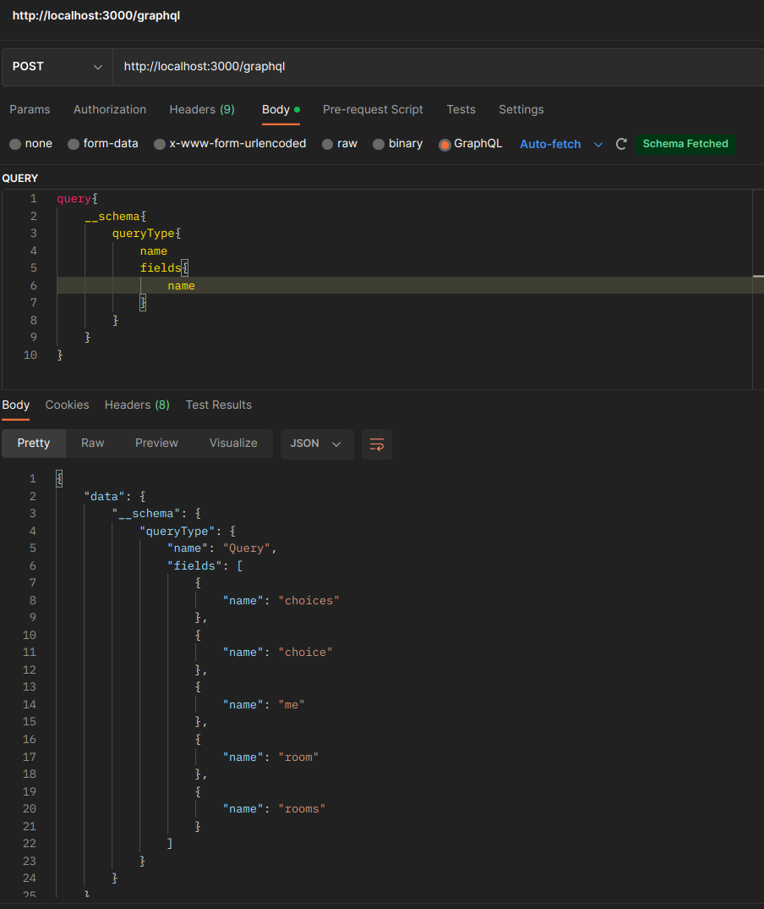
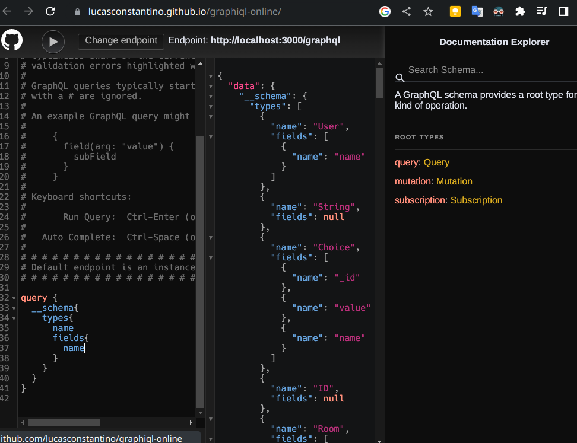

# api

## Testing
You can use Post man or any online tool like [graphiql-online](https://lucasconstantino.github.io/graphiql-online/)

### Docker containers
Run `docker exec -it <container_id> /bin/bash` to connect to specific container.

Run `mongosh --port 27017 -u root -p root --authenticationDatabase admin` in the db container shell to connect to mongodb.  

Run `use rpsls` to switch to RPSLS database collections.
Please refer to MongoDB [data manipulation spec](https://www.mongodb.com/docs/manual/crud/) for details.

## API
